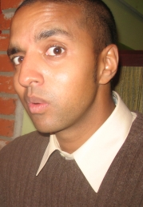

!SLIDE transition=scrollLeft

!SLIDE transition=scrollLeft
# David Tchepak #
## davesquared.net ##
## @davetchepak ##

!SLIDE bullets incremental transition=scrollLeft
# TDD and OOO #

* (Over-enthusiastic OO)

!SLIDE center transition=scrollLeft

!SLIDE center transition=scrollLeft

_(src: http://www.city-data.com/forum/science-technology/331224-theoritical-quantum-mechanics-2.html)_

!SLIDE bullets transition=scrollLeft

* TDD for problem decomposition and design

!SLIDE bullets transition=scrollLeft

* Taking things too far as a learning experience

!SLIDE code incremental transition=scrollLeft
#String Calculator Kata

    @@@ csharp
    "" → 0
    "1,2,3" → 6
    "1\n2,3,4" → 10

    //Extra requirement: custom delimiters
    "//;\n5;6;7" → 18

!SLIDE bullets transition=scrollLeft
#Why the dodgy example?
* Lends itself perfectly to traditional TDD
* Highlights the differences in OOO style.
* Can fit into ~30 minutes.

!SLIDE bullets incremental transition=scrollLeft
#The sane approach
* Build up an implementation one test at a time
* Feed a bunch of test data through our method
* Publish kata on intraweb
* ...
* Profit?!!?!

!SLIDE bullets center transition=scrollLeft
#Our approach
* Use the tests to help decompose the problem into smaller problems.
* Push the smaller problems into dependencies

!SLIDE bullets transition=scrollLeft
# Take OO principles...
* (SOLID, LoD, encapsulation, GRASP ...)

!SLIDE center transition=scrollLeft
#...and turn them up to 11

!SLIDE bullets center transition=scrollLeft
# Over-enthusiastic SRP

* Object can do a trivial bit work 
* XOR 
* coordinate collaborators

_Not both_

!SLIDE bullets center transition=scrollLeft
# WARNING!
* Ridiculousness ahead.

!SLIDE transition=scrollLeft
#Let's go!#

!SLIDE transition=scrollLeft
#And we're back

!SLIDE bullets transition=scrollLeft
#Hey anonymous dude!
* That's an hour of my life I'll never get back.
* Thanks for nothing!

!SLIDE bullets transition=scrollLeft
#WAIT!!!
* Some of this is _actually_ useful for real problems!

!SLIDE bullets incremental transition=scrollLeft
# A SOLID design emerged
* Classes have ONE responsibility (SRP)
* Extended behaviour (change number parsing) without major mods to classes (OCP)
* Small, focused interfaces (ISP)
* Class depend on abstractions, top-down (DIP)

!SLIDE bullets incremental transition=scrollLeft
# Flexible tests and maintainable code
* Refactor via tweaking contexts
* Trivial implementations
* Small objects and abstractions → easier to change big bits of behaviour 

!SLIDE bullets incremental transition=scrollLeft
# How did this happen?
* Over-enthusiastic SRP
* Responsibility plus context → _scenario name_
* How should SUT react? → _test name and assertion_
* Why? → _Because()_
* Sub-responsibilities → _dependencies; drive out via Context()_

!SLIDE bullets transition=scrollLeft
# Adding a dash of pragmatism
* Switching styles as required
* Defactoring

!SLIDE bullets incremental center transition=scrollLeft
#Take aways (fries with that?)

!SLIDE bullets incremental transition=scrollLeft
# Use TDD to help OO design
* Know and push the limits of OO (et al.)
* Tests can provide mental framework for thinking about OO
* Decompose problems → objects/classes
* Responsibility assignment
* Test logic over data; drive design over implementation

!SLIDE bullets center transition=scrollLeft
#THANKS!
* Post with code and links will be up shortly at http://davesquared.net

